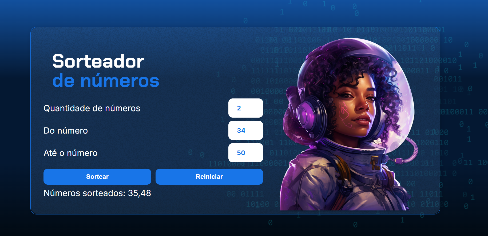

# Sorteador de número

Projeto realizado durante o Curso de Lógica de programação: praticando com desafios

### Sobre o projeto

Você irá escolher a quantidade de números que será sorteada e informar o numero minimo e máximo para serem escolhidos. 

### Tecnologias utilizadas 

## Quer jogar ?

Acesse o jogo pelo link [JOGAR AQUI](https://number-drawer-kappa.vercel.app/)

## Quer aprender a desenvolver sistemas assim como eu ?

Utilize meu cupom de desconto na [Alura com 15% OFF](https://www.alura.com.br/indica-dev/priscilacaimi)
